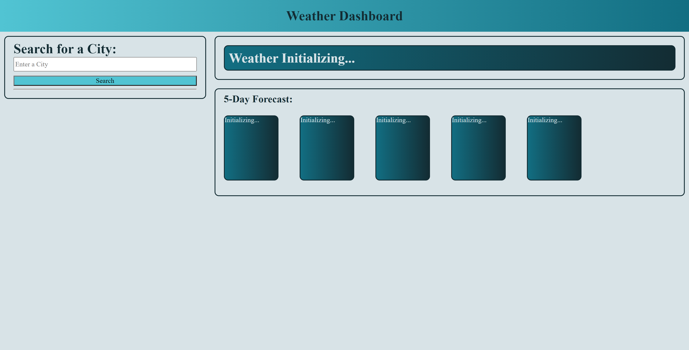

# 06-HW-weatherDashboard
- Check the local weather of any city!

[Live site!](https://mmonyok.github.io/06-HW-weatherDashboard/)

## Description
- Understanding server-side APIs is an important part of my coding journey. Working with them on this project will go a long way in assisting me in developing my coding skills and knowledge. 
- The changing weather and its patterns are an integral part of daily life for everyone. Knowing the current and future weather will help anyone make or change plans, depending on how the weather affects them. This webpage allows for one to check the current weather, as well as the weather for the next 5 days.
- This project helped me better solidy my JavaScript knowledge, especially as switched to working predominantly in jQuery. I also learned a lot more about navigating server-side APIs, changing their parameters, and finding how to best manipulate them for my needs.

## Table of Contents
- [06-HW-weatherDashboard](#06-hw-weatherdashboard)
  - [Description](#description)
  - [Table of Contents](#table-of-contents)
  - [Installation](#installation)
  - [Usage](#usage)
  - [Credits](#credits)
  - [License](#license)
  - [Badges](#badges)
  - [Contact](#contact)

## Installation
1. Provided that you have a code editor of your choosing installed on your system, such as VS Code (https://code.visualstudio.com/),

2. Provided that you have a Terminal installed for Windows (https://www.microsoft.com/en-us/p/windows-terminal/9n0dx20hk701?rtc=1&activetab=pivot:overviewtab) or are using a Mac with Terminal installed with the OS,

3. You have Git and Github Desktop installed (https://git-scm.com/downloads, https://desktop.github.com/) and have registered for an account,

4. Either Clone or Fork this repository: https://github.com/mmonyok/06-HW-weatherDashboard,

5. Create your own repository for the files on GitHub.

6. Edit in your code editor and continue to commit, push changes and perform other Git actions using your repository https://docs.gitlab.com/ee/gitlab-basics/start-using-git.html.

## Usage
- Enter a city name in the search box. If you search with state, you must also search with country code, separated by commas.
- The current forecast, as well as the forecast for the next 5 days will be displayed.
- Recent city searches will be displayed below the search box; click on any of them to search that city again.

## Credits
- Technologies Used:
  - [jQuery](https://jquery.com/)
  - [Open Weather Map API](https://openweathermap.org/api)
    - [Current Weather Data](https://openweathermap.org/current)
    - [One Call API](https://openweathermap.org/api/one-call-api)
  - [ScreenToGIF](https://www.screentogif.com/)

- Tutorials Followed:
[JavaScript Weather App Tutorial using Openweathermap API for beginners | Javascript tutorial](https://youtu.be/GXrDEA3SIOQ)
[Professional README guide template provided by Coding Boot Camp.](https://github.com/coding-boot-camp)

- Additional Assets:
[Color palette taken from colorhunt.co; it is color palette #273466.](https://colorhunt.co/palette/282007)

## License
- MIT License

- Copyright (c) [2021] [Melody Monyok]

- Permission is hereby granted, free of charge, to any person obtaining a copy
of this software and associated documentation files (the "Software"), to deal
in the Software without restriction, including without limitation the rights
to use, copy, modify, merge, publish, distribute, sublicense, and/or sell
copies of the Software, and to permit persons to whom the Software is
furnished to do so, subject to the following conditions:

- The above copyright notice and this permission notice shall be included in all
copies or substantial portions of the Software.

- THE SOFTWARE IS PROVIDED "AS IS", WITHOUT WARRANTY OF ANY KIND, EXPRESS OR
IMPLIED, INCLUDING BUT NOT LIMITED TO THE WARRANTIES OF MERCHANTABILITY,
FITNESS FOR A PARTICULAR PURPOSE AND NONINFRINGEMENT. IN NO EVENT SHALL THE
AUTHORS OR COPYRIGHT HOLDERS BE LIABLE FOR ANY CLAIM, DAMAGES OR OTHER
LIABILITY, WHETHER IN AN ACTION OF CONTRACT, TORT OR OTHERWISE, ARISING FROM,
OUT OF OR IN CONNECTION WITH THE SOFTWARE OR THE USE OR OTHER DEALINGS IN THE
SOFTWARE.

## Badges

## Contact
- Melody Monyok
  - <monyokwebdev@gmail.com>
  - (612) 492-1528